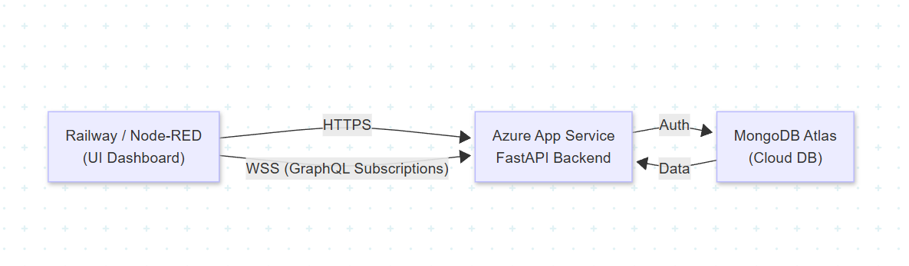
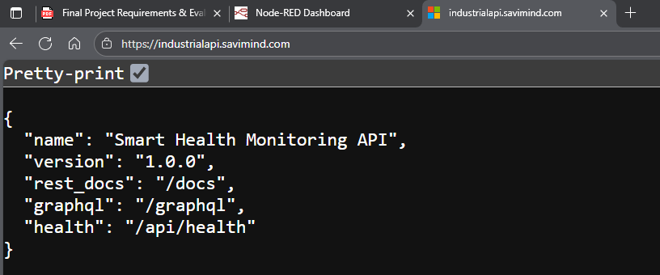

# Cloud Mapping — Smart Health Monitoring System

**Student:** Joel Saravia – Universidad Anáhuac Mayab
**Project:** Health Monitoring System (Option B)

---

## ☁️ Cloud Deployment Architecture

Mapping of cloud services used to deploy the Smart Health Monitoring System across **Azure**, **MongoDB Atlas**, and **Railway** platforms.





---

## 1. API Hosting — **Azure App Service**

**Service:** Azure App Service (Linux, Python 3.12)
**Deployed URL:** [https://industrialapi.savimind.com](https://industrialapi.savimind.com)
**Demo URL:** [YouTube](https://youtu.be/rAdTeCjZlCo)

### Configuration

| Property      | Value                           |
| ------------- | ------------------------------- |
| Platform      | Microsoft Azure                 |
| Service Type  | App Service (Web App)           |
| Resource Name | `api-finalprojectindustrialrev` |
| Runtime Stack | Python 3.12                     |
| OS            | Linux                           |
| Pricing Tier  | Basic B1 (~$8/month)            |
| Region        | East US                         |

### Why Azure App Service?

* **Managed Platform:** No server maintenance required
* **WebSocket Support:** Essential for GraphQL subscriptions (`liveVitals`)
* **CI/CD Integration:** GitHub Actions deploy on every push
* **Built-in SSL:** Automatic HTTPS with custom domains
* **Scalability:** Can scale horizontally if traffic increases

### What's Hosted Here?

* FastAPI REST API (`/api/*`)
* Strawberry GraphQL endpoint (`/graphql`)
* JWT authentication system
* Real-time WebSocket subscriptions

---

## 2. Database Service — **MongoDB Atlas**

**Service:** MongoDB Atlas (M0 Free Tier Cluster)

### Configuration

| Property         | Value                          |
| ---------------- | ------------------------------ |
| Platform         | MongoDB Atlas                  |
| Cluster Tier     | M0 (Free)                      |
| Region           | AWS us-east-1                  |
| Cloud Provider   | AWS (managed by MongoDB Atlas) |
| Storage          | 512 MB                         |
| Replication      | 3-node replica set             |
| Security         | IP Whitelist + Authentication  |
| Backup           | Automated (Atlas managed)      |

### Why MongoDB Atlas?

* **Fully Managed:** No database administration needed
* **Cloud Agnostic:** Works with any API hosting platform
* **Free Tier:** Sufficient for academic project scale
* **Document Model:** Perfect for health vitals time-series data
* **Scalability:** Can upgrade to paid tiers

### Collections Stored

* `patients` — Patient profiles and current status
* `vitals` — Time-series vital signs (heart rate, oxygen, temperature, steps)
* `alerts` — Critical threshold alerts
* `users` — Authentication (JWT tokens)
* `settings` — System configuration and thresholds

---

## 3. File Storage — **Not Required**

I decided to not use traditional file storage (like S3, Azure Blob, or Cloud Storage) because:

* All data is stored as **JSON documents** in MongoDB
* **CSV exports** are generated dynamically by Node-RED flows
* **Node-RED flows** are stored as JSON configuration files in the Git repository
* No user-uploaded files or media assets

If file storage were needed in the future, the system could easily integrate:

* **Azure Blob Storage** (native integration with Azure App Service)
* **AWS S3** (industry standard)
* **MongoDB GridFS** (for files stored alongside database records)
* **Functionality via API** 

---

## 4. Node-RED Dashboard — **Railway.app**

**Service:** Railway (Docker Container Hosting)
**Deployed URL:** [https://nodered.savimind.com/ui](https://nodered.savimind.com/ui)

### Configuration

| Property       | Value                       |
| -------------- | --------------------------- |
| Platform       | Railway.app                 |
| Container      | `nodered/node-red:latest`   |
| Region         | GCP us-west1                |
| Pricing        | ~$5/month                   |
| Build Time     | ~3-5 minutes                |
| Custom Domain  | nodered.savimind.com        |
| SSL            | Automatic (Let's Encrypt)   |

### Why Railway?

* **Docker Native:** Runs official Node-RED container
* **Simple Deployment:** One-click deploy from GitHub
* **Cost Effective:** Much cheaper than FlowFuse ($29/month → $5/month)
* **Built on GCP:** Reliable infrastructure
* **Auto SSL:** Free certificates included

---

## 📊 Architecture

```
┌─────────────────────────────────────────┐
│  Node-RED Dashboard (Railway/GCP)       │
│  https://nodered.savimind.com/ui        │
│  • Simulation Controls                  │
│  • Real-time Monitoring                 │
│  • Alerts & Reports                     │
└────────────────┬────────────────────────┘
                 │ HTTPS / WebSocket
                 ▼
┌─────────────────────────────────────────┐
│  FastAPI + GraphQL (Azure App Service)  │
│  https://industrialapi.savimind.com     │
│  • REST API (/api/*)                    │
│  • GraphQL (/graphql)                   │
│  • JWT Authentication                   │
└────────────────┬────────────────────────┘
                 │ MongoDB Driver (Motor)
                 ▼
┌─────────────────────────────────────────┐
│  MongoDB Atlas (AWS us-east-1)          │
│  • patients                             │
│  • vitals (time-series)                 │
│  • alerts                               │
│  • users                                │
│  • settings                             │
└─────────────────────────────────────────┘
```

## 💰 Monthly Cost Breakdown

| Service          | Provider      | Cost      |
| ---------------- | ------------- | --------- |
| API Hosting      | Azure         | ~$8/month |
| Dashboard        | Railway (GCP) | ~$5/month |
| Database         | MongoDB Atlas | Free      |
| **Total**        |               | **$13**   |

---

## 📋 Database Schema

The system uses MongoDB with the following collections and document structures:

### Collection: `patients`

Stores patient profiles and current health status. Each patient has a friendly ID (e.g., P-101) and tracks their latest vital readings.

**Model Reference:** `domain/models/patient.py::PatientInDB`

```json
{
  "_id": "ObjectId",
  "patient_id": "string (unique, e.g., 'P-101')",
  "patient_name": "string (1-100 chars)",
  "status": "string (OK | ALERT | CRITICAL, default: 'OK')",
  "last_heart_rate": "integer | null (bpm, 0-300)",
  "last_oxygen_level": "integer | null (%, 0-100)",
  "last_body_temperature": "float | null (°C, 30.0-45.0)",
  "last_steps": "integer | null (step count)",
  "last_update": "datetime | null (last vital reading timestamp)",
  "created_at": "datetime (UTC, auto-generated)"
}
```

### Collection: `vitals`

Time-series vital signs data for trend analysis. Receives data from Node-RED devices and stores normalized readings.

**Model Reference:** `domain/models/vital.py::VitalInDB`

```json
{
  "_id": "ObjectId",
  "patient_id": "string (ref: patients.patient_id)",
  "heart_rate": "integer (bpm, 0-300)",
  "oxygen_level": "integer (%, 0-100)",
  "body_temperature": "float (°C, 30.0-45.0)",
  "steps": "integer (≥0)",
  "timestamp": "datetime (reading time from device)",
  "created_at": "datetime (UTC, when stored in DB)"
}
```

### Collection: `alerts`

Critical threshold alerts triggered when vital signs exceed configured thresholds.

**Model Reference:** `domain/models/vital.py::AlertInDB`

```json
{
  "_id": "ObjectId",
  "alert_id": "string (friendly ID, e.g., 'ALT-001')",
  "patient_id": "string (ref: patients.patient_id)",
  "metric": "string (heart_rate | oxygen_level | body_temperature)",
  "type": "string (HIGH | LOW)",
  "value": "float (actual reading that triggered alert)",
  "threshold": "float (configured threshold value)",
  "status": "string (ACTIVE | ACKNOWLEDGED | RESOLVED, default: 'ACTIVE')",
  "created_at": "datetime (UTC, when alert triggered)",
  "acknowledged_at": "datetime | null (when acknowledged by staff)"
}
```

### Collection: `users`

Authentication and user management with JWT token-based security.

**Model Reference:** `domain/models/user.py::UserInDB`

```json
{
  "_id": "ObjectId",
  "username": "string (unique, 3-50 chars)",
  "hashed_password": "string (bcrypt hash, min 6 chars original)",
  "is_active": "boolean (default: true)",
  "created_at": "datetime (UTC, auto-generated)"
}
```

### Alert Thresholds Configuration

Configurable thresholds for triggering alerts (stored in application config or database).

**Model Reference:** `domain/models/vital.py::ThresholdSettings`

```json
{
  "heart_rate_high": "integer (default: 120 bpm)",
  "heart_rate_low": "integer (default: 50 bpm)",
  "oxygen_level_low": "integer (default: 92%)",
  "body_temperature_high": "float (default: 38.0°C)",
  "body_temperature_low": "float (default: 35.5°C)"
}
```

### Indexes

* `patients.patient_id`: Unique index for fast patient lookups
* `vitals.patient_id + vitals.timestamp`: Compound index for time-series queries
* `alerts.patient_id + alerts.created_at`: Compound index for alert history
* `alerts.alert_id`: Unique index for friendly alert IDs
* `users.username`: Unique index for authentication

---

## ✅ Cloud Mapping Summary

✔️ **API Hosting:** Azure App Service (Python FastAPI + GraphQL)
✔️ **Database Service:** MongoDB Atlas M0 (Free Tier, AWS-backed)
✔️ **File Storage:** Not required (all data in MongoDB documents)
✔️ **Node-RED:** Railway.app (Docker, GCP infrastructure)

---